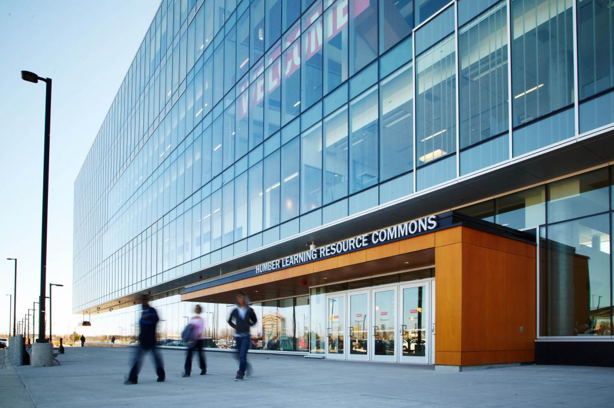

  

# GACI Project

> Building better academic curriculum workflows for Humber Polytechnic.

The **GACI Project** team develops GACI Online, a secure platform for managing academic programs, curriculum structures, course learning outcomes, and program-level mapping workflows.

## What we build

- Academic program and course management
- Curriculum and CLO mapping
- Academic-year workflows
- Workbook and review processes
- Role-based administrative access
- Secure, auditable academic operations

## Project links

- [GACI Online](https://gaci.humber.ca)
- [GACI Online source repository](https://github.com/Anmol-STRS/gaci-online)

## Technology

- Next.js and TypeScript
- Python and FastAPI
- PostgreSQL
- Docker
- GitHub Actions

## Contact

For project-related questions, contact **gaci@humber.ca**.
